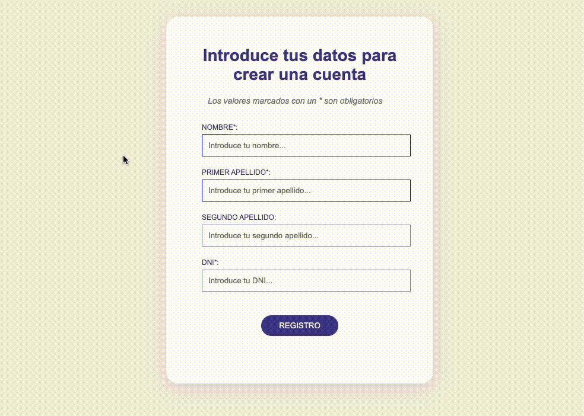

En esta sesión tenemos dos apartados de tarea.

**1) CSS DINER:** Un juego que nos ayudará a asentar los conocimientos sobre selectores avanzados. ¿Hasta que nivel eres capaz de llegar?

> http://flukeout.github.io/

**2) Formulario:** Os toca realizar un formulario con el objetivo de asentar conocimientos sobre pseudo-clases y pseudo-elementos:



Tips para la realización:

- Nombre y apellidos son obligatorios por lo que debemos ponerles un borde de 1px azul
- El campo DNI muestra un borde rojo si la info no es valida (pattern="[0-9]{8}[A-Za-z]{1}”)
- El botón cambia de color a verde cuando pasas por encima y a negro cuando haces click
- La sección del formulario tiene que estar centrada horizontalmente sobre el body
- Para la sombra de la sección usar:

```css
box-shadow: rgba(100, 100, 111, 0.2) 0px 7px 29px 0px;
```

- La letra usar ‘font-family: Arial, Helvetica, sans-serif’
- Los colores están sacados del listado por defecto, no hacen falta que sean iguales.

¡A por ello!